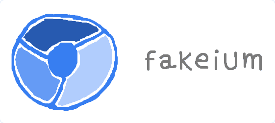

<p align="center"><a href="https://github.com/josemmo/fakeium"></a></p>
<p align="center">
    <a href="https://github.com/josemmo/fakeium/actions"></a>
    <a href="https://www.npmjs.com/package/fakeium"></a>
    <a href="https://github.com/XAMPPRocky/tokei"></a>
    <a href="LICENSE"></a>
</p>

Fakeium (a play on the words *Fake* and *Chromium*) is a lightweight, V8-based sandbox for the dynamic execution of
untrusted JavaScript code.
It aims to improve traditional static analysis by detecting API calls coming from `eval`, `new Function` and heavily
obfuscated code, and does so with a tiny footprint in terms of both memory and CPU usage.

While originally designed to elicit the behavior of browser extensions *at scale* without having to launch an
instrumented Chromium browser instance and wait about 10 minutes between runs, it can also run any modern JavaScript
code in mere **seconds**.

## Features
Fakeium works by mocking all objects accessed by the executed code at runtime, while logging get, set and call events.
It automatically runs all callback functions found inside the sandbox to increase execution coverage.

It has built-in support for:
- 📦 [JavaScript modules](https://developer.mozilla.org/docs/Web/JavaScript/Guide/Modules)
- 🔗 [Custom origins](https://developer.mozilla.org/docs/Glossary/Origin)
- 🎨 Object tainting
- ⏰ Execution limits (max memory usage and timeout)
- 🎣 Custom hooks
- 🧾 Logging
- 🕵 Event tracing (code that triggered it)
- 🔎 Report events querying

## FAQ
**Who is Fakeium intended for?**\
Fakeium is aimed at security researchers who want to determine the behavior of a JavaScript application, browser
extension, website, etc.
For example, it can be used to detect calls to privacy sensitive APIs or fingerprinting attempts.

**Why use Fakeium instead of Chromium with Playwright/Puppeteer/Selenium?**\
When running experiments at scale, it is not always possible to use traditional dynamic analysis due to time and
resource constraints.
In addition, finding good inputs that trigger a sample's malicious code path typically requires manual effort and is not
always possible.
Fakeium is a good alternative when you hit any of these limitations.

**Why use Fakeium instead of static analysis?**\
Fakeium does not try to replace traditional static analysis with tools like Babel or Esprima.
Instead, it complements it by increasing analysis coverage through the detection of API calls that would otherwise go
undetected.

## Getting Started

### Requirements
- Node.js 20 (LTS)

### How To Install
```sh
# Using npm
npm install fakeium

# Using Yarn
yarn add fakeium
```

### Examples
The easiest way to run code with Fakeium is to create an instance and call the `Fakeium.run()` method:

```js
import { Fakeium } from 'fakeium';

(async () => {
    const fakeium = new Fakeium();
    await fakeium.run('example.js', 'alert("Hi there!")');

    // Print all logged events
    const events = fakeium.getReport().getAll();
    console.dir(events, { depth: 4 });
})();
```

This simple script will produce this console output:
```js
[
    {
        type: 'GetEvent',
        path: 'alert',
        value: { ref: 1 },
        location: { filename: 'file:///example.js', line: 1, column: 1 }
    },
    {
        type: 'CallEvent',
        path: 'alert',
        arguments: [ { literal: 'Hi there!' } ],
        returns: { ref: 2 },
        isConstructor: false,
        location: { filename: 'file:///example.js', line: 1, column: 1 }
    }
]
```

You can also run apps that span several modules by providing a resolver:
```js
import { Fakeium } from 'fakeium';

(async () => {
    const fakeium = new Fakeium({ sourceType: 'module', origin: 'https://localhost' });
    fakeium.setResolver(async url => {
        if (url.href === 'https://localhost/index.js') {
            return 'import { test } from "./test.js";\n' +
                'console.log("Test is " + test());\n';
        }
        if (url.pathname === '/test.js') {
            return 'export const test = () => 123';
        }
        return null;
    });
    await fakeium.run('index.js');

    // Print a particular event
    const logEvent = fakeium.getReport().find({ type: 'CallEvent', path: 'console.log' });
    console.dir(logEvent, { depth: 4 });
})();
```

This will produce the following output:
```js
{
    type: 'CallEvent',
    path: 'console.log',
    arguments: [ { literal: 'Test is 123' } ],
    returns: { literal: undefined },
    isConstructor: false,
    location: { filename: 'https://localhost/index.js', line: 2, column: 9 }
}
```

## Working with Hooks
The Fakeium sandbox can be customized for more tailored needs through the use of *hooks*.
Developers can use hooks to modify variables from the sandbox's global scope, as well as to expose bindings that run code outside the isolated environment (for instance, to perform network requests).

Hooks are defined using the following arguments:
```ts
fakeium.hook(path: string, value: unknown, isWritable = true): void;
```

There are three types of hooks, that behave differently, depending on the hooked value:

### Serializable values
Strings, numbers, plain objects, `ArrayBuffer`s, `undefined` and other variables that support serialization through the [structured clone algorithm](https://developer.mozilla.org/docs/Web/API/Web_Workers_API/Structured_clone_algorithm) are **copied** into the sandbox.

```js
fakeium.hook('navigator.userAgent', 'Mozilla/5.0 (Android 4.4; Mobile; rv:41.0) Gecko/41.0 Firefox/41.0');
fakeium.hook('config', {
    isDesktop: false,
    seed: 42,
});
```

### Bindings (functions)
When passing a function, Fakeium exposes a binding inside the sandbox that, when invoked, will execute the function in the **outside world**.
Bindings can receive arguments and return values, provided they are serializable through the [structured clone algorithm](https://developer.mozilla.org/docs/Web/API/Web_Workers_API/Structured_clone_algorithm).
Returning promises or awaitable values is also supported.

> [!WARNING]
> Be careful about what logic you expose to the sandbox when running untrusted code.

```js
fakeium.hook('getIpAddress', async () => {
    return await fetch('/api/get-ipv4').then(res => res.json());
})
```

### References
When passing a `Reference` instance, Fakeium will redirect all calls that point to the hook to a different path **inside** the sandbox.
By default, Fakeium uses this feature to alias the `globalThis` variable to `window`, among other variables.

```js
import { Reference } from 'fakeium';

fakeium.hook('anotherWindow', new Reference('globalThis'));
```
